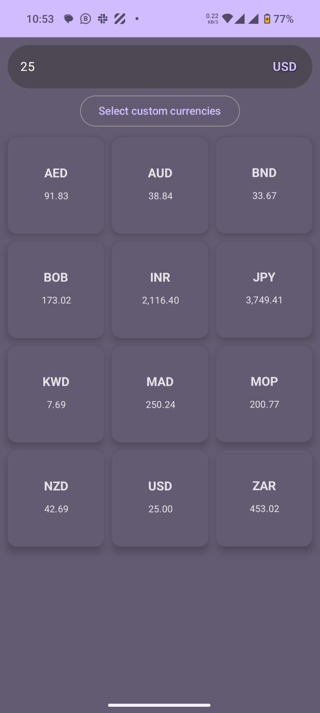

# Currency Converter App

## App Overview

A modern, efficient currency conversion application built with cutting-edge Android development technologies.

## 🚀 Key Technologies
- Jetpack Compose
- MVVM Architecture
- Room Database
- WorkManager
- OpenExchangeRates API

## 📱 App Screenshots

 
*Main Screen: Currency Conversion Interface*
<p align="center">
   
   
</p>
*Currency Selection Screen*

## ✨ Features

### 1. Main Screen
- Input field for conversion amount
- Dynamic grid of currency conversion rates
- Currency selection button
- Custom currency selection option

#### Main Screen Capabilities
- Real-time currency conversion
- Instant rate updates
- Flexible currency selection
- Customizable currency grid

### 2. Currency Selection Screen
#### Two Primary Modes:
1. **Single Currency Selection**
   - Search currencies by name or country
   - Quick currency replacement

2. **Multiple Currency Selection**
   - Advanced multi-select mode
   - Select All/Unselect All functionality
   - Custom currency grid configuration

## 🔧 Technical Architecture

### Architecture Pattern
- MVVM (Model-View-ViewModel)
- Separation of concerns
- Testable and maintainable codebase

### Data Management
- **Room Database**: Local currency storage
- **WorkManager**: Automated hourly currency rate updates
- **OpenExchangeRates API**: Real-time exchange rate data

### Dependency Injection
- Hilt/Dagger (specify your implementation)

## 🌐 API Integration
- OpenExchangeRates API for live exchange rates
- Hourly rate synchronization
- Robust error handling

## 📊 Data Synchronization
- Background worker updates rates every hour
- Seamless offline functionality
- Persistent local database cache

## 🧪 Testing
- Comprehensive Unit Testing
- ViewModel test coverage
- Repository layer testing
- Mocked API responses

## 🔒 Performance Optimization
- Efficient data fetching
- Minimal battery consumption
- Optimized WorkManager scheduling

## 📦 Installation

### Prerequisites
- Android Studio Arctic Fox or later
- Kotlin 1.7+
- OpenExchangeRates API Key

### Setup Steps
1. Clone the repository
2. Add API key in `local.properties`
3. Sync Gradle
4. Run the application

## 🛠 Configuration

### API Key Configuration
```properties
OPEN_EXCHANGE_RATES_API_KEY=your_api_key_here
```

## 🤝 Contributing
1. Fork the repository
2. Create your feature branch
3. Commit changes
4. Push to the branch
5. Create pull request

## 📄 License
[Specify your license]

## 👥 Developed By
[Your Name/Organization]

## 📞 Support
For issues, feature requests, please open a GitHub issue.
